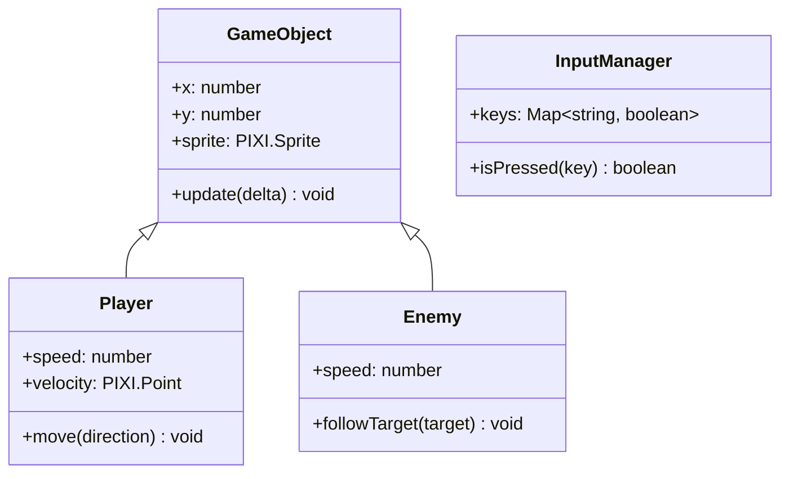

# SPEC.md - Proyecto de Videojuego

## 1. Información del Proyecto

- **Nombre del Juego:** Space Defender
- **Curso:** Programación de Videojuegos 1 - UNAHUR
- **Profesor:** Facundo Saiegh
- **Integrantes:** [Nombre del estudiante]
- **Fecha de Entrega:** Primer Parcial

---

## 2. Game Design Document (GDD)

### 2.1 Idea y Mecánicas

**Concepto:** Juego de nave espacial en vista superior (top-down) donde el jugador controla la rotacion de la nave y cuando dispara 

**Mecánicas Principales:**
- Nave puede rotar en la dirección del movimiento ("A"rota hacia la izquierda, "D" rota hacia la derecha o sus contrapartes en las flechas)
- la nave tiene una ulti un ataque especial que se carga a medida que va destruyrndo asteroides(al tocar "s" o la flcha hacia abajo se activa)
- la nave dispara proyectile con (W hacia la direccion que esta viendo o donde la punta da la nave se encuentra a la hora de rotar)
- Enemigos básicos (asteroide) que se mueven hacia el jugador y si son muy grandes rota como una orbita hacia el 
- el tamaño de los enemigos influye en su velocidad
- si los enimigos tocan la nave pierda una vida o baja su nivel de escudos de la nave
- los enemigos pueden ser destruido por los proyectiles que dispara la nave y comvertirce en asteroides mas pequeños o ya venir en un tamaño mas pequeño  
- Sistema de puntuación por destruir
- sistema de 3 vidas
- los proyectiles hacen daño a los asteroides y los van rompiendo en asteroides mas pequeños
- los enemigos vienen en 3 diferentes tamaños, grade, mediano y pequeño. 
- los grandes y medianos se rompen hasta llegar al tamaño pequeño 

### 2.2 Controles

| Tecla | Acción |
|-------|--------|
| W / Flecha Arriba | disparar |
| S / Flecha Abajo | ulti |
| A / Flecha Izquierda | rota hacia la izquierda |
| D / Flecha Derecha | rota hacia la derecha |

---

## 3. Estética

### 3.1 Paleta de Colores

| Color | Hex | Uso |
|-------|-----|-----|
| Negro Espacial | #0D0D1A | Fondo del juego |
| Violeta Nebula | #2D1B4E | Elementos de fondo |
| Birome Azul | #0044CC | Nave, proyectiles, UI y efectos |
| Birome Rojo | #CC0000 | Enemigos (asteroides) |
| Blanco Estelar | #FFFFFF | Estrellas partículas |

### 3.2 Spritesheets

- **Nave del Jugador:** "Nave vista desde arr.png" (asset proporcionado)
- **Enemigos:** Spritesheet LPC genérico o drawn asset
- **Fondos:** Generados procedimentalmente (estrellas)

---

## 4. Arquitectura de Código

### 4.1 Estructura de Clases

```
src/
├── main.js              # Punto de entrada
├── game/
│   ├── Game.js         # Clase principal del juego
│   ├── GameObject.js   # Clase base para entidades
│   ├── Player.js       # Nave del jugador
│   ├── Enemy.js        # Enemigos
│   └── Background.js   # Fondo con estrellas
├── systems/
│   ├── InputManager.js # Gestión de teclado
│   └── Renderer.js     # Configuración PixiJS
└── utils/
    └── Assets.js       # Singleton para carga de recursos
```

### 4.2 Diagrama de Clases



---

## 5. Requisitos del Primer Parcial

- [x] GDD con mecánicas definidas
- [x] Paleta de colores definida (Birome Azul y Birome Rojo)
- [x] Spritesheet animado y en movimiento (nave + asteroides)
- [x] Código con estructura de clases
- [ ] Sin errores en consola
- [ ] Ejecutándose en GitHub Pages

---

## 6. Tech Stack

- **Motor:** PixiJS v8
- **Lenguaje:** JavaScript ES6+
- **Servidor:** Node.js con serve

---

## 7. Notas de Implementación

- Usar el singleton `Assets` de PixiJS para carga de texturas
- Implementar interpolación lineal (Lerp) para movimiento suave de cámara
- Canvas resolution: 800x600 (escalable)
- Target: 60 FPS
